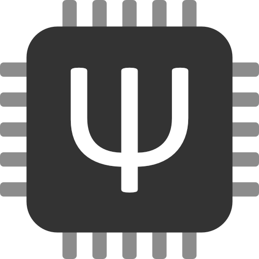
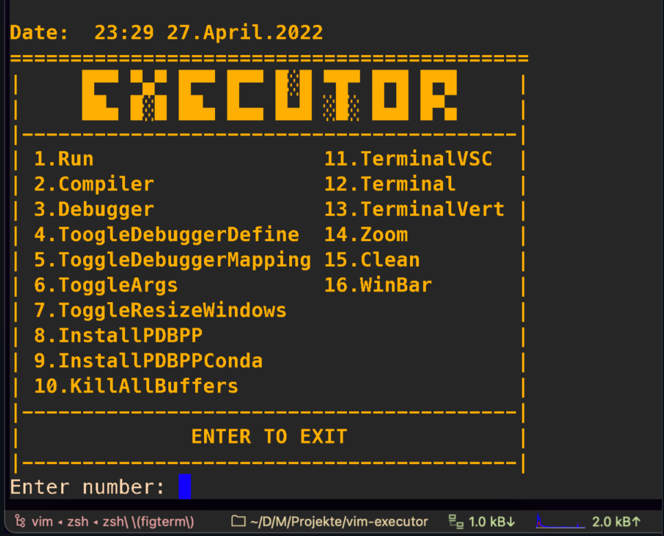

<h1 align="center">Hi there, I'm Rodrigo - Cero-M </h1>

<table align="right">
<tr>
<td>

<!-- [][youtube]
[][twitter]
[][instagram]
[][facebook]
[][reddit] -->

</td>
</tr>
</table>

  
:zap: About me!

### full stack developer-technician in renewable energy and 3dprint  💻!!

- 🤓  I’m currently learning everything
- 👾  I am very curious and that is why you start studying programming

<!--  

---

<h3 align="center"> Latest Projects</h3>

<tr>
<td>

[][gm]

</td>
<td> <h4 align="left"> <a href="https://github.com/rodrigovera424" target="_blank"><code>GitManager</code></a> </h4> </td>
</tr>
<tr>
<td>

</td>
<!--  -->
<!-- <td> <h4 align="right"> <a href="https://github.com/mctechnology17/vim-better-header" target="_blank"><code>vim-better-header</code></a> </h4> </td>
</tr>
<tr>
<td>

[][vimtools]

</td>
<td> <h4 align="left"> <a href="https://github.com/mctechnology17/vimtools" target="_blank"><code>vimtools</code></a> </h4> </td>
</tr>
<tr>
<td>

[][zmk-config]

</td>
<td> <h4 align="right"> <a href="https://github.com/mctechnology17/zmk-config/" target="_blank"><code>zmk-config</code></a> </h4> </td>
</tr>
<tr>
<td>

[][qmk-config]

</td>
<td> <h4 align="left"> <a href="https://github.com/mctechnology17/qmk-config/" target="_blank"><code>qmk-config</code></a> </h4> </td>
</tr>

<tr>
<td>

[][executor]

</td>
<td> <h4 align="right"> <a href="https://github.com/mctechnology17/vim-executor" target="_blank"><code>executor</code></a> </h4> </td>
</tr> -->

 
  -->

---

<h3 align="center"> Languages and Tools</h3>

    
    
    
    
    
    
    
    
    
    
    
    
    
    
    
    
    

---

<!-- <h3 align="left"> latest Videos</h3>

<!-- YOUTUBE:START -->
<!-- - [corne keyboard animaciones con QMK &lpar;bongocat, luna, crab, ocean-dream&rpar; | MC Technology](https://www.youtube.com/watch?v=_dswDmpqY0A)
- [corne keyboard animaciones para teclado custom con QMK &lpar;bongocat y mas ...&rpar; | MC Technology](https://www.youtube.com/watch?v=w9Z_ODrKhvQ)
- [corne keyboard full wireless nicenano tutorial &lpar;guia facil&rpar; | MC Technology](https://www.youtube.com/watch?v=YVi7ROevBAI)
- [Ejecuta y depura código en VIM con SOLO 1 click + multiterminales | MC Technology](https://www.youtube.com/watch?v=uba3mR7RNhg)
- [Depurando en VIM con vimspector | MC Technology](https://www.youtube.com/watch?v=wIU6Roqmljs)
<!-- YOUTUBE:END -->

<!-- ➡️ [more videos...](https://www.youtube.com/channel/UC_mYh5PYPHBJ5YYUj8AIkcw)

--- --> 

<h3 align="left"> GitHub Stats</h3>

  <a href="https://github.com/mctechnology17">
  
  

---

